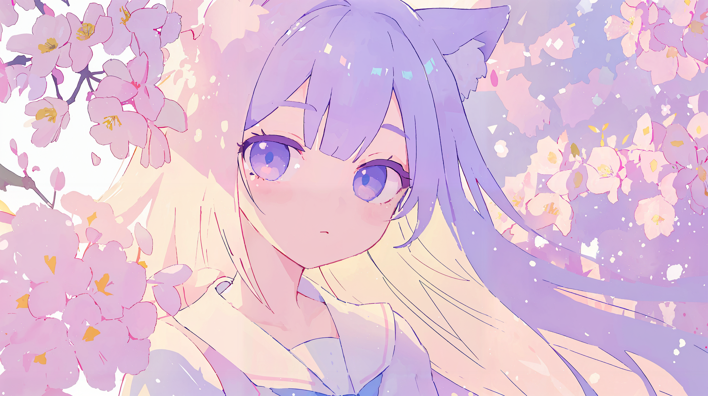
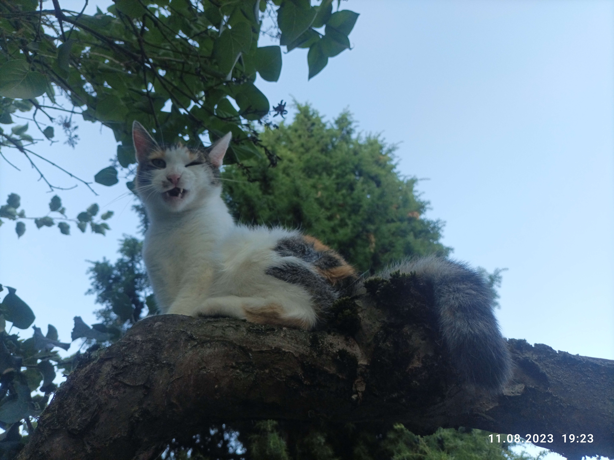

> [!IMPORTANT]
> I recently updated my GitHub username from `sefinek24` to `sefinek`. Please make sure to update any associated links (:   
> https://github.com/sefinek24 -> https://github.com/sefinek  
> https://raw.githubusercontent.com/sefinek24 -> https://raw.githubusercontent.com/sefinek

[//]: # ()

[I got really fucking drunk last night. Smoked a bunch of dope til five in the morning. Ended up passing out in the sewer pipe cause it's kind of cramped back here and my back's a little sore. Anyways, slept there, had a pretty good sleep, but I still had to get up early this morning cause I got responsibles now. Growed up, I got kids. A lot of people say you can't smoke dope and get drunk when you have kids but that's not true. You can. But you still gotta get up in the morning. That's being responsible.](https://www.youtube.com/watch?v=uQa1YyNOc_o)

### 🌍 〢 Projects
🏠 » [sefinek.net](https://sefinek.net) • My official website  
✨ » [api.sefinek.net](https://api.sefinek.net) • Free API; filters, random animals, etc.  
🎮 » [stella.sefinek.net](https://sefinek.net/genshin-stella-mod) • The best & safe mod for Genshin Impact  
😻 » [nekosia.cat](https://nekosia.cat) • API with random anime images & booru

[//]: # (🛒 » [market.sefinek.net]&#40;https://market.sefinek.net&#41; • Shop with game accounts, etc.)

### 😺 〢 I like...

      
    

### 😾 〢 I don't like...

    

### 😻 〢 Meow

    
    

    

